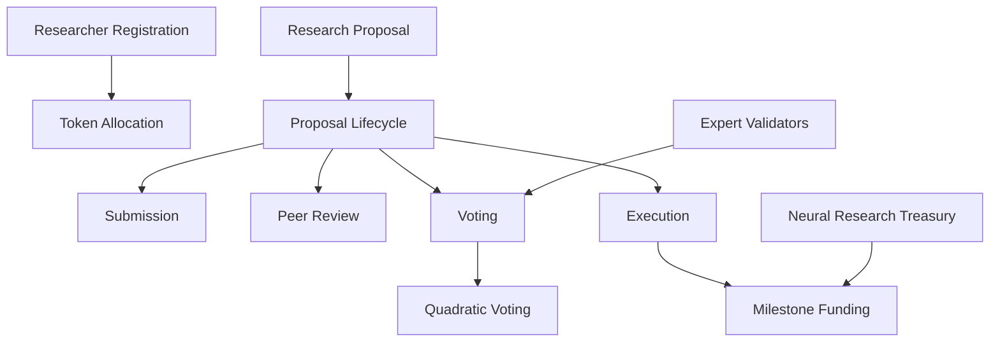

# Commitment Neural List (CNL)

A decentralized platform for collaborative AI research funding, governance, and innovation through blockchain technology.

## Overview

Commitment Neural List enables decentralized collaboration in AI research by providing a transparent, community-driven platform for:

- Proposing cutting-edge neural network and AI research projects
- Leveraging quadratic voting for funding allocation
- Democratizing AI research investment
- Supporting milestone-based project development
- Enabling global researcher participation

## Architecture

The platform operates through a smart contract managing membership, proposal lifecycle, and decentralized resource allocation.



### Core Components

1. **Membership System**
   - Token-based researcher access
   - Expert validator designation
   - Voting delegation capabilities

2. **Research Proposal Lifecycle**
   - Four phases: Submission, Peer Review, Voting, Execution
   - Milestone-driven funding
   - Transparent quadratic voting

3. **Research Treasury Management**
   - Secure fund allocation
   - Milestone-based disbursement
   - Transparent balance tracking

## Contract Documentation

### neural-commitment.clar

The core smart contract managing platform operations.

#### Key Functions

1. Researcher Management
```clarity
(define-public (register-researcher (token-amount uint) (is-expert bool)))
(define-public (delegate-research-votes (delegate principal)))
```

2. Research Proposal Management
```clarity
(define-public (create-research-proposal 
                (title (string-ascii 100))
                (description (string-utf8 1000))
                (research-link (string-ascii 255))
                (funding-amount uint)
                (research-milestones (list 10 {...}))))
```

3. Voting and Execution
```clarity
(define-public (vote-on-research-proposal (proposal-id uint) (vote-for bool)))
(define-public (finalize-research-proposal (proposal-id uint)))
```

## Getting Started

### Prerequisites

- Clarinet
- Stacks Wallet
- Neural Commitment (NCL) tokens

### Basic Usage

1. Register as a researcher:
```clarity
(contract-call? .neural-commitment register-researcher u1000 false)
```

2. Create a research proposal:
```clarity
(contract-call? .neural-commitment create-research-proposal 
    "Advanced Neural Network Optimization"
    "Developing efficient transformer architectures"
    "https://research.example.com/proposal"
    u50000
    research-milestones)
```

3. Vote on a proposal:
```clarity
(contract-call? .neural-commitment vote-on-research-proposal u1 true)
```

## Development

### Testing
```bash
clarinet test
```

### Local Development
```bash
clarinet console
clarinet deploy
```

## Security Considerations

- Decentralized access control
- Transparent voting mechanisms
- Milestone-based fund release
- Quadratic voting to prevent token concentration

## Ethical AI Research Commitment

Commitment Neural List is dedicated to promoting responsible, transparent, and collaborative AI research that prioritizes societal benefit and ethical considerations.